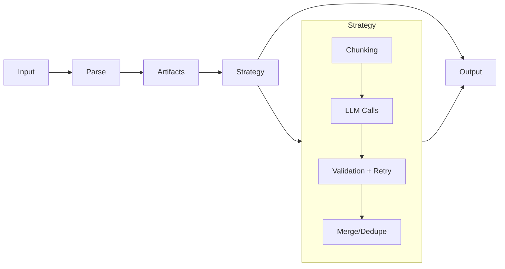

import { Callout } from 'fumadocs-ui/components/callout';
import { Card, Cards } from 'fumadocs-ui/components/card';
import { TypeTable } from 'fumadocs-ui/components/type-table';

## Inputs and Artifacts

Struktur converts input files into **Artifacts** before extraction. For plain text or stdin, this is trivial. For structured files (PDFs, Office documents), Struktur runs a parser — built-in or custom — that extracts text and images per-page.

<Cards>
  <Card title="Document Parsing" description="Learn how files are converted to artifacts" href="/docs/explanation/document-parsing" />
  <Card title="Artifact Format" description="Understand the artifact data structure" href="/docs/explanation/artifact-format" />
</Cards>

## The Strategy layer

A strategy is the orchestration engine. It decides how to split the input, how many LLM calls to make, whether to run them concurrently or sequentially, and how to combine results.

Built-in strategies cover the common patterns. You can also write your own.

<Callout type="info">
  See [Strategies](/docs/explanation/strategies) for the complete strategy reference.
</Callout>

## Validation inside the loop

The validation loop is a key differentiator. Every LLM response is validated against the schema **before** the strategy considers it done. If validation fails, the errors are serialized and sent back to the model as a follow-up message.

<Callout type="info">
  **Smart validation**: For multi-step strategies (parallel, sequential, double-pass), Struktur uses lenient validation during intermediate steps—required field violations are allowed until the final step. This prevents false failures when data is split across chunks. Use the `strict` option to disable this behavior.
</Callout>

Most extractions converge within two attempts. This happens **inside** the strategy, not as a post-processing step.

Default: `maxAttempts` = 3.

See [Validation & Retries](/docs/explanation/validation) for the validation concept.

## The result

<TypeTable
  type={{
    data: {
      description: 'Validated output matching your schema. If error is set, may not be trustworthy.',
      type: 'T',
      required: true,
    },
    usage: {
      description: 'Aggregated token counts across all LLM calls',
      type: 'Usage',
      required: true,
    },
    error: {
      description: 'Set if extraction encountered a non-fatal error',
      type: 'Error | undefined',
      required: false,
    },
  }}
/>

## See also

- [Document Parsing](/docs/explanation/document-parsing) — how files are converted to artifacts
- [Artifacts](/docs/explanation/artifact-format) — the input format
- [Strategies](/docs/explanation/strategies) — orchestration patterns
- [Chunking & Token Budgets](/docs/explanation/chunking) — how large documents are split
- [Validation & Retries](/docs/explanation/validation) — the retry loop
