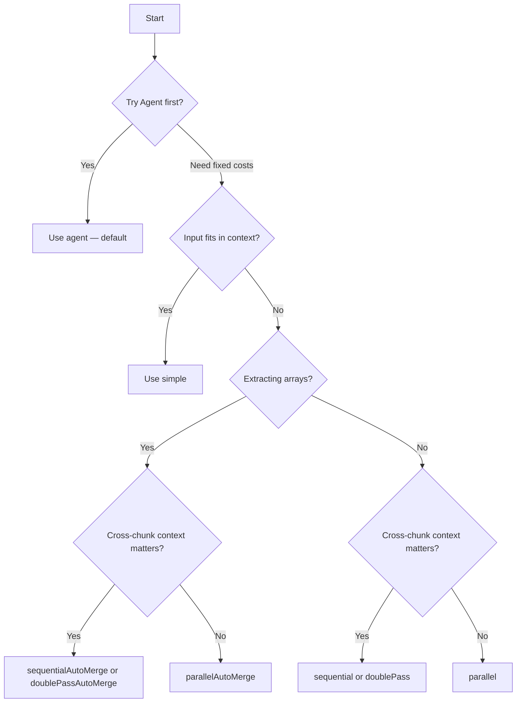

import { TypeTable } from 'fumadocs-ui/components/type-table';
import { Callout } from 'fumadocs-ui/components/callout';
import { Card, Cards } from 'fumadocs-ui/components/card';
import { Tabs, Tab } from 'fumadocs-ui/components/tabs';

The **Agent** strategy is the default and recommended way to use Struktur. It gives the LLM a virtual filesystem and lets it autonomously decide how to extract your data.

For documents where you need more control, Struktur also provides alternative strategies that use fixed chunking and parallelism patterns.

## Strategy comparison

| Strategy | Speed | Context | Arrays | Token Cost | Best For |
|----------|-------|---------|--------|-----------|----------|
| `agent` (default) | Adaptive | Adaptive | Automatic | Varies | **Most documents** |
| `simple` | Fastest | Full | — | Lowest | Small inputs |
| `parallel` | Fast | None | LLM merge | Medium | Speed priority |
| `sequential` | Medium | Full | Context | Medium | Context-dependent |
| `parallelAutoMerge` | Fast | None | Auto + dedupe | Medium | Large arrays |
| `sequentialAutoMerge` | Medium | Full | Auto + dedupe | Medium | Ordered arrays |
| `doublePass` | Slow | Full | LLM merge | High | Maximum quality |
| `doublePassAutoMerge` | Slow | Full | Auto + dedupe | High | Quality + arrays |

---

## Agent (Default)

<Callout type="info">
  **The Agent strategy is the default.** You don't need to specify `--strategy agent` — it's used automatically when you run `struktur extract`.
</Callout>

Autonomous extraction using a virtual filesystem. The agent decides when to read files, search for patterns, and build output incrementally.

<Cards>
  <Card title="Best For" description="Most documents — adapts automatically" />
  <Card title="Virtual FS" description="read, grep, find, ls, bash" />
  <Card title="Output Tools" description="set_output_data, update_output_data" />
  <Card title="Model Requirement" description="Must support tool calling" />
</Cards>

### How it works

1. **Document loaded** into virtual filesystem (`/artifacts/artifact.json`, `/artifacts/manifest.json`, `/artifacts/images/`)
2. **Agent explores** using tools: read files, grep for patterns, list directories, execute commands
3. **Incremental extraction** — calls `set_output_data` when first data found, `update_output_data` as more discovered
4. **Validation** — schema validation on every output update, with automatic retry on errors
5. **Completion** — agent calls `finish` when done, or `fail` if extraction impossible

The agent adapts to your document:
- **Small documents** — reads everything at once
- **Large documents** — navigates systematically, searching for relevant sections
- **Complex schemas** — builds output incrementally, validating as it goes

### Configuration

<TypeTable
  type={{
    provider: {
      description: 'Provider name (e.g., anthropic, openai)',
      type: 'string',
      required: true,
    },
    modelId: {
      description: 'Model identifier (e.g., claude-sonnet-4, gpt-4o)',
      type: 'string',
      required: true,
    },
    maxSteps: {
      description: 'Maximum agent steps/turns',
      type: 'number',
      default: '50',
      required: false,
    },
    apiKey: {
      description: 'API key (or use env vars)',
      type: 'string',
      required: false,
    },
    outputInstructions: {
      description: 'Additional extraction guidance',
      type: 'string',
      required: false,
    },
    systemPrompt: {
      description: 'Override default system prompt',
      type: 'string',
      required: false,
    },
  }}
/>

### Example

<Tabs items={['CLI', 'SDK']}>
  <Tab value="CLI">
```bash
# Agent is the default — no --strategy needed
struktur extract --input ./document.pdf \
  --schema ./schema.json \
  --model anthropic/claude-sonnet-4

# With max steps limit
struktur extract --input ./document.pdf \
  --schema ./schema.json \
  --model anthropic/claude-sonnet-4 \
  --max-steps 30
```
  </Tab>
  <Tab value="SDK">
```ts
import { extract, agent } from "@struktur/sdk";

const result = await extract({
  artifacts,
  schema,
  strategy: agent({
    provider: "anthropic",
    modelId: "claude-sonnet-4",
    maxSteps: 50,
  }),
});
```
  </Tab>
</Tabs>

### When to use

- **Always try agent first** — it's the default for a reason
- Works well for most document types and sizes
- Automatically adapts to document structure
- Best for complex schemas with nested objects

### Model compatibility (March 2026)

The agent requires models that support tool/function calling:

| Provider | Compatible Models (2026) |
|----------|--------------------------|
| Anthropic | Claude Opus 4.6, Claude Sonnet 4.6, Claude Haiku 4.5 |
| OpenAI | GPT-5.4, GPT-5.4 Pro, GPT-5.2, GPT-4o |
| Google | Gemini 3.1 Pro, Gemini 2.5 Pro, Gemini 2.5 Flash |
| xAI | Grok 4, Grok 4 Beta |
| Mistral | Mistral Large 3, Mistral Medium 3, Mistral Small 3.1 |

### Recommended models for extraction

| Use Case | Model | Cost (per 1M tokens) | Why |
| -------- | ----- | -------------------- | ----- |
| **Best quality** | Claude Sonnet 4.6 | $3.00/$15.00 | Best balance of quality and cost |
| **Latest frontier** | GPT-5.4 | $2.50/$15.00 | Native computer use, 1M context |
| **Large docs** | Gemini 3.1 Pro | $2.00/$12.00 | 2M token context |
| **Budget extraction** | Mistral Small 3.1 | $0.20/$0.60 | Cheapest capable |

### OpenRouter budget picks

| Model | Cost (per 1M) | Best For |
| ----- | ------------- | -------- |
| Qwen3-235B-Thinking | $0.30/$1.20 | Best reasoning at low cost |
| google/gemini-2.0-flash-lite | $0.25/$1.50 | Fast, cheap, vision |
| mistralai/mistral-small-2603 | $0.15/$0.60 | Best price/quality |
| deepseek/deepseek-chat | $0.28/$1.10 | Excellent reasoning |

<Callout type="warn">
  Some models claim tool support but don't work well with the agent. Avoid: older GPT-4o-mini (inconsistent tool calling), GPT-3.5 models.
</Callout>

### Virtual filesystem

The agent has access to a virtual filesystem containing:

- `/artifacts/artifact.json` — All artifacts in JSON format (images replaced by virtual paths)
- `/artifacts/manifest.json` — Summary and metadata
- `/artifacts/images/` — Extracted image files (when artifacts have embedded images)

The agent can:
- **Read** files with pagination (`offset`, `limit`)
- **Grep** for patterns
- **Find** files by name
- **List** directories
- **Bash** execute commands (on virtual filesystem only)

### Output management

Special tools for building extraction output:

- **`set_output_data(data)`** — Set initial output (first time data is found)
- **`update_output_data(changes)`** — Merge changes into existing output
- **`finish()`** — Complete extraction (only works if data validates)
- **`fail(reason)`** — Mark extraction as impossible

The agent is encouraged to update output continuously as it explores, not wait until the end.

---

## Simple

Single-shot extraction for small inputs. Use when the agent is overkill for tiny documents.

<Cards>
  <Card title="LLM Calls" description="1" />
  <Card title="Parallelism" description="None" />
  <Card title="Best for" description="Small, single-chunk inputs" />
</Cards>

### Configuration

<TypeTable
  type={{
    model: {
      description: 'Model instance from @ai-sdk/*',
      type: 'LanguageModel',
      required: true,
    },
    outputInstructions: {
      description: 'Extra instructions for the model',
      type: 'string',
      required: false,
    },
    strict: {
      description: 'Always true for simple (single-shot, no intermediate steps)',
      type: 'boolean',
      default: 'true',
      required: false,
    },
  }}
/>

### Algorithm

1. Build extraction prompt from artifacts + schema
2. Send to LLM
3. Validate output against the schema
4. Retry on validation failure (up to 3 attempts)
5. Return validated output

### Example

<Tabs items={['CLI', 'SDK']}>
  <Tab value="CLI">
```bash
struktur extract --input document.txt --schema schema.json --strategy simple
```
  </Tab>
  <Tab value="SDK">
```js
import { extract, simple } from "@struktur/sdk";
import { openai } from "@ai-sdk/openai";

const result = await extract({
  artifacts,
  schema,
  strategy: simple({
    model: openai("gpt-4o-mini"),
  }),
});
```
  </Tab>
</Tabs>

### When to use

- Document fits within the model's context window (~10k tokens)
- Simple schema without nested arrays
- Testing or prototyping
- Speed is the priority
- When you want predictable token costs (agent costs vary by document)

---

## Parallel

Concurrent batch processing with LLM merge.

<Cards>
  <Card title="LLM Calls" description="N batches + 1 merge" />
  <Card title="Parallelism" description="Full" />
  <Card title="Best for" description="Large inputs, speed priority" />
</Cards>

### Configuration

<TypeTable
  type={{
    model: {
      description: 'Model for extraction',
      type: 'LanguageModel',
      required: true,
    },
    mergeModel: {
      description: 'Model for merging partial results',
      type: 'LanguageModel',
      required: true,
    },
    chunkSize: {
      description: 'Token budget per batch',
      type: 'number',
      required: true,
    },
    concurrency: {
      description: 'Max parallel batches',
      type: 'number',
      default: 'All batches',
      required: false,
    },
    maxImages: {
      description: 'Max images per batch',
      type: 'number',
      default: 'Unlimited',
      required: false,
    },
    outputInstructions: {
      description: 'Extra instructions',
      type: 'string',
      required: false,
    },
    strict: {
      description: 'Validate required fields on every step',
      type: 'boolean',
      default: 'false',
      required: false,
    },
  }}
/>

### Algorithm

1. Split artifacts into batches (respecting `chunkSize` and `maxImages`)
2. Extract from each batch concurrently
3. Validate each batch output with retry
4. Send all partial results to `mergeModel` for LLM merge
5. Validate merged output
6. Return final result

### Example

<Tabs items={['CLI', 'SDK']}>
  <Tab value="CLI">
```bash
struktur extract --input large.pdf --schema schema.json --strategy parallel --model openai/gpt-4o-mini
```
  </Tab>
  <Tab value="SDK">
```js
import { extract, parallel } from "@struktur/sdk";
import { openai } from "@ai-sdk/openai";

const result = await extract({
  artifacts,
  schema,
  strategy: parallel({
    model: openai("gpt-4o-mini"),
    mergeModel: openai("gpt-4o-mini"),
    chunkSize: 10000,
    concurrency: 3,
  }),
});
```
  </Tab>
</Tabs>

### When to use

- Speed is the top priority
- Chunks are relatively independent
- Many documents to process
- Can accept potential loss of cross-chunk context
- When agent costs are too high for your use case

---

## Sequential

Process chunks in order with context preservation.

<Cards>
  <Card title="LLM Calls" description="N batches" />
  <Card title="Parallelism" description="None" />
  <Card title="Best for" description="Context-dependent documents" />
</Cards>

### Configuration

<TypeTable
  type={{
    model: {
      description: 'Model for extraction',
      type: 'LanguageModel',
      required: true,
    },
    chunkSize: {
      description: 'Token budget per batch',
      type: 'number',
      required: true,
    },
    maxImages: {
      description: 'Max images per batch',
      type: 'number',
      default: 'Unlimited',
      required: false,
    },
    outputInstructions: {
      description: 'Extra instructions',
      type: 'string',
      required: false,
    },
    strict: {
      description: 'Validate required fields on every step',
      type: 'boolean',
      default: 'false',
      required: false,
    },
  }}
/>

### Algorithm

1. Split artifacts into batches
2. For each batch in order:
   - Build prompt including previous extraction result as context
   - Extract from batch
   - Validate with retry
   - Store result for next iteration
3. Return final result

### Example

<Tabs items={['CLI', 'SDK']}>
  <Tab value="CLI">
```bash
struktur extract --input report.pdf --schema schema.json --strategy sequential --model openai/gpt-4o-mini
```
  </Tab>
  <Tab value="SDK">
```js
import { extract, sequential } from "@struktur/sdk";
import { openai } from "@ai-sdk/openai";

const result = await extract({
  artifacts,
  schema,
  strategy: sequential({
    model: openai("gpt-4o-mini"),
    chunkSize: 10000,
  }),
});
```
  </Tab>
</Tabs>

### When to use

- Context between chunks matters
- Building data incrementally (e.g., accumulating line items)
- Later sections reference earlier sections
- Need better accuracy than parallel
- Agent is making too many tool calls for your document structure

---

## Auto-Merge Strategies

<Callout type="info">
  Strategies with "AutoMerge" in the name use schema-aware merge and deduplication. They're ideal for extracting arrays that may have duplicates across chunks.
</Callout>

### parallelAutoMerge

Parallel extraction with schema-aware merge and deduplication.

**Best for:** Array extraction from large inputs where speed matters.

### sequentialAutoMerge

Sequential extraction with schema-aware merge and deduplication.

**Best for:** Ordered array extraction where context matters.

### doublePassAutoMerge

Double-pass extraction with schema-aware merge and deduplication.

**Best for:** Large array extraction with maximum quality requirement.

---

## Choosing a Strategy

**Start with the Agent.** It's the default because it works best for most documents.

| Strategy | When to use |
|---|---|
| `agent` (default) | **Start here** — autonomous exploration for most documents |
| `simple` | Small input, fits in one context window, predictable costs |
| `parallel` | Large input, order doesn't matter, speed priority |
| `sequential` | Large input, context carries across chunks |
| `parallelAutoMerge` | Large input with arrays — parallel + dedup |
| `sequentialAutoMerge` | Large input with arrays — sequential + dedup |
| `doublePass` | Quality matters, two-pass refinement |
| `doublePassAutoMerge` | Quality + arrays + dedup |

### Quick decision flowchart



---

## See also

- [The Extraction Pipeline](/docs/explanation/pipeline) — where strategies fit
- [Chunking & Token Budgets](/docs/explanation/chunking) — how batches are formed
- [Validation & Retries](/docs/explanation/validation) — the retry loop
